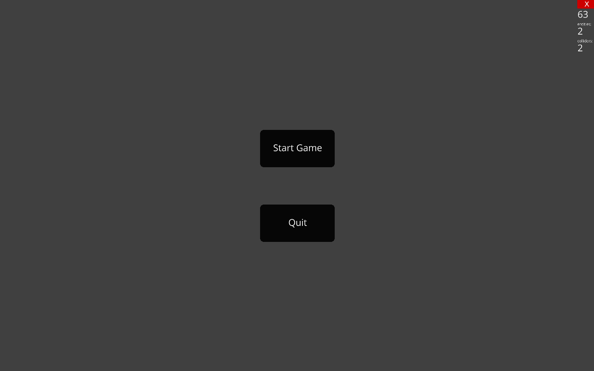
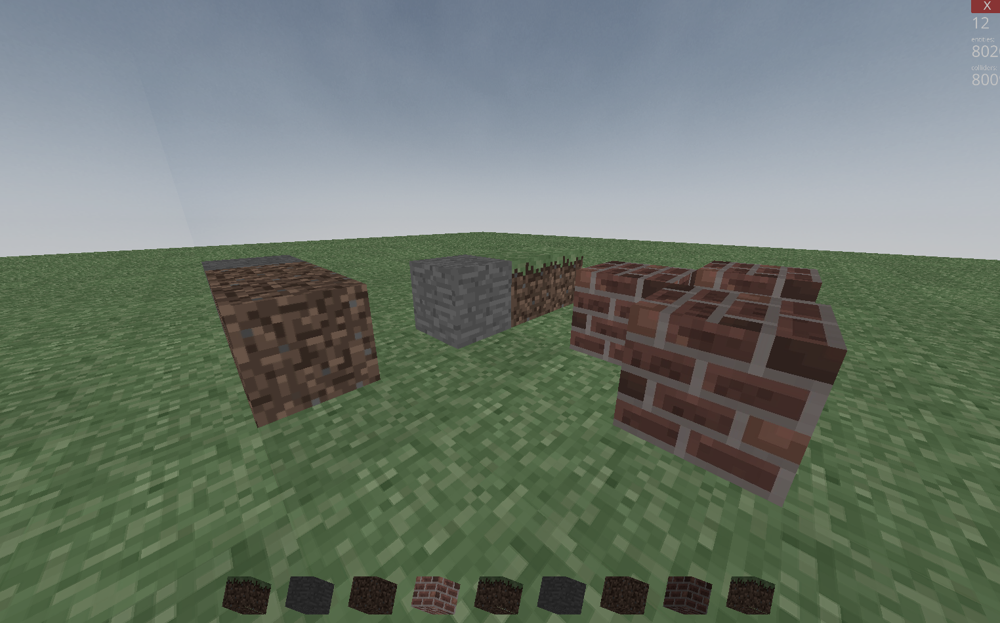
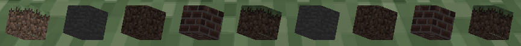

# Minecraft Clone in Python with Ursina

This project implements a basic voxel-based game inspired by Minecraft, developed as a college mini-project using Python and the Ursina game engine. It demonstrates core concepts in 3D game development, including procedural world generation, real-time block interaction, and user interface elements.

## Features

- **Procedural World Generation**: Creates a flat voxel terrain with layers of bedrock, dirt, and grass.
- **Block Interaction**: Place and destroy blocks using mouse clicks, with ray casting for accurate positioning.
- **First-Person Controls**: Move around with WASD, jump with space, and look with mouse.
- **User Interface**: Main menu for starting the game, and a hotbar for block selection (selection not fully wired to placement).
- **Asset Management**: Textures, 3D models, and audio loaded centrally for efficiency.

## Requirements

- Python 3.11+
- Ursina engine (`pip install ursina`)
- OpenGL and audio libraries (included in the Nix environment via `shell.nix`)

## Installation

1. Clone the repository:
   ```
   git clone https://github.com/your-username/your-repo.git
   cd your-repo
   ```

2. (Optional) Use Nix for a reproducible development environment (includes Python 3.11 and auto-activated virtual environment):
   ```
   nix-shell
   ```

3. Install dependencies using requirements.txt:
   ```
   pip install -r requirements.txt
   ```
   This installs Ursina 7.0.0 and all required dependencies (Panda3D, Pillow, etc.).

   If not using Nix, ensure you have Python 3.11+ installed.

## Usage

Run the game:
```
python main.py
```

## Controls

- **Movement**: W/A/S/D to move, Space to jump
- **Camera**: Mouse movement to look around
- **Interaction**: Left-click to place block, Right-click to destroy (breakable blocks only)
- **Hotbar**: 1-9 to select slots (selection not affecting placement in current version)
- **Quit**: Escape key

## Project Structure

- `main.py`: Application entry point and game loop
- `src/classes.py`: Game entity classes (Voxel, Sky, Menu, Hotbar) and asset loading
- `Assets/`: Textures, models, and audio files
- `images/`: Screenshots for documentation
- `report.tex`: Detailed academic report on the project
- `includes/ref.bib`: Bibliography references

## Limitations and Future Work

- Hotbar selection does not affect block type placed (always brick)
- No chunk-based rendering; all 8000 voxels rendered at once
- No collision for newly placed blocks
- No world persistence
- Suggestions: Implement chunking, procedural terrain, persistence, and more block types

## Screenshots

### Main Menu


### Block Placement


### Hotbar Interface


## References

- [Ursina Engine Documentation](https://www.ursinaengine.org/)
- [Minecraft](https://www.minecraft.net/) (for inspiration and asset style)</content>
<parameter name="filePath">README.md